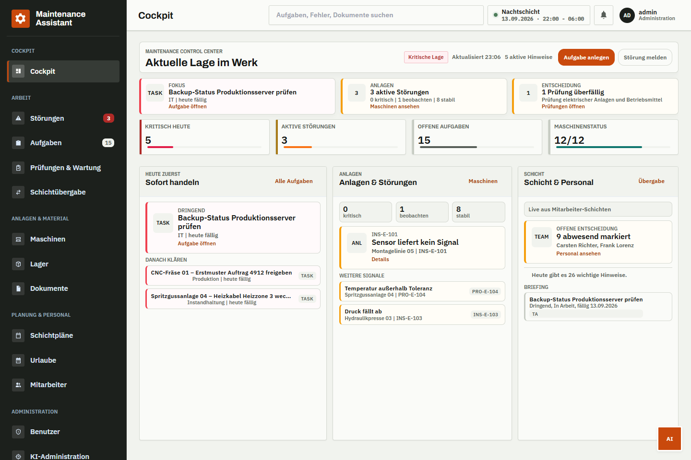
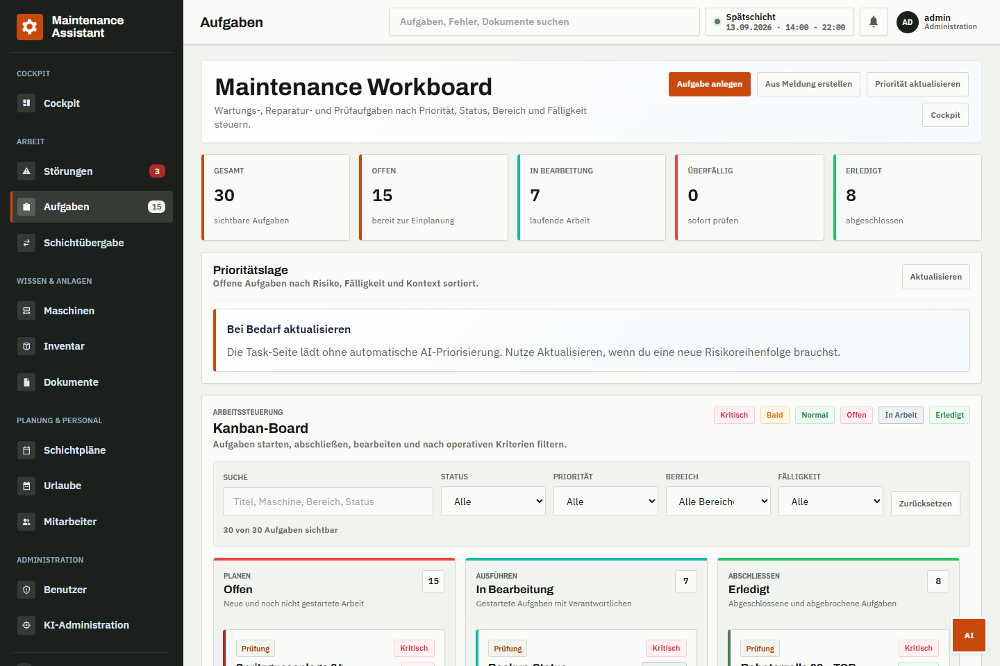
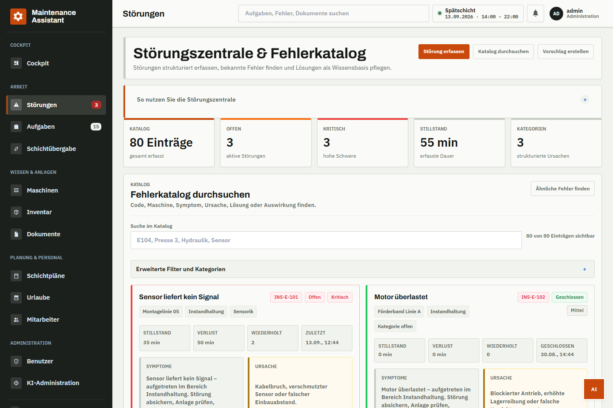
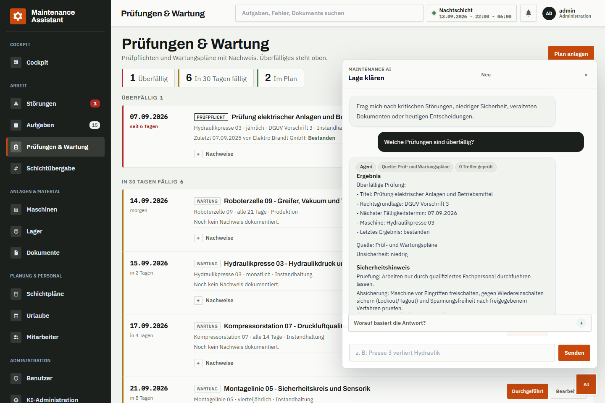
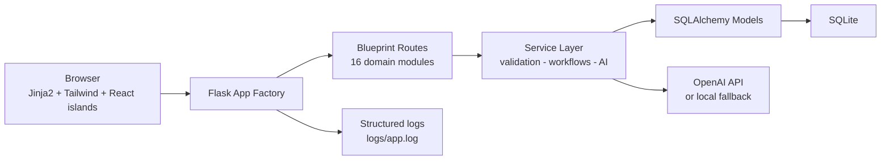
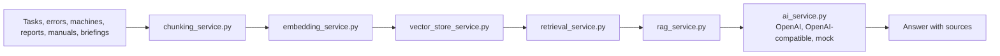

# Maintenance Assistant

[](https://github.com/siinanXD/maintenance-ai-assistant/actions/workflows/ci.yml)
[](https://www.python.org/)
[](./Dockerfile)

A full-stack AI SaaS demo for industrial maintenance teams. The app connects
tasks, fault catalogs, machines, shift planning, documents, inventory and
AI-assisted knowledge retrieval in one role-aware operations cockpit.

## Why this project matters

Maintenance teams lose time when tasks, machine history, shift context and
manuals live in separate tools. This project demonstrates how a production
maintenance assistant can combine operational workflows with an auditable AI/RAG
layer: the assistant answers with sources, falls back to local rules without an
API key, and keeps sensitive employee or admin data behind permissions.

## Portfolio highlights

- **Full-stack product surface:** Flask app factory, SQLAlchemy domain models,
  Jinja/Tailwind shell, React route islands, Tailwind CSS and Docker deployment.
- **SaaS-grade access control:** JWT authentication, role-based navigation,
  per-dashboard permissions and audit logs for critical admin actions.
- **AI-readiness without lock-in:** OpenAI and OpenAI-compatible provider
  integration, deterministic local fallback, RAG indexing, source visibility
  policies and retrieval diagnostics.
- **Tool-using agent with human-in-the-loop:** LangGraph agent loop over
  permission-gated tools, signed confirmations for write actions, per-user
  rate limits and token budgets, offline-evaluable tool selection.
- **Operational workflows:** tasks, errors, machines, documents, inventory,
  shift planning, handover, vacations, notifications and backups.
- **Quality baseline:** pytest coverage gate in CI, Ruff, compile checks,
  frontend type checks, OpenAPI docs and Docker build workflow.

## Screenshots

These screenshots are captured from the running app and reflect the current
checked-in UI state.

| Dashboard | Tasks |
| --- | --- |
|  |  |

| Error Catalog | AI Features |
| --- | --- |
|  |  |

## Features

**Auth & Access Control**
- JWT authentication with role-based navigation
- Per-dashboard read/write permissions configurable by admins
- Security audit log for user, permission, backup, restore, and shift plan changes
- SMTP email notifications with dry-run mode and delivery dedupe
- Employee data access tiers: none / basic / shift / confidential

**Tasks & Errors**
- Department-scoped task and error catalog management
- AI-assisted task suggestions from free text, with priority scoring
- Similar-error detection to avoid duplicate catalog entries
- Recurring fault trend detection for preventive recommendations and briefings
- Structured follow-up prompts for incomplete fault and knowledge entries
- Local maintenance tag suggestions from seeded categories for faults, tasks and knowledge drafts
- Automatic HTML maintenance reports on task completion
- Server-side PDF export, versioning, approval workflow, and summaries for reports
- Machine manual upload, text extraction, analysis, and searchable metadata

**AI Integration** (OpenAI optional, local fallback included)
- Daily briefing summarizing tasks, inventory, errors, and documents
- Machine assistant answering questions from the asset history
- Document quality review for maintenance reports
- Shift plan generation respecting ArbZG work-time rules
- Transparent OpenAI diagnostics for rate limits, invalid keys, blocked models, timeouts, and connection errors
- Searchable chat history for users and master-admin-wide AI audit views
- Local RAG v1 knowledge base for TXT/HTML/PDF maintenance documents
- Knowledge quality workflow from draft and AI suggestion to technician/admin review

**Workforce & Production**
- Employee management with qualifications and preferred machine
- Structured employee-machine qualification matrix for shift planning
- Machine management with production content and staffing requirements
- Drag-and-drop shift planner with publish workflow and audit log
- Shift conflict checks for vacation, double planning, qualification, coverage and ArbZG rules
- XLSX shift plan export and print-optimized PDF workflow
- Persistent in-app notifications with a real unread topbar badge
- Shift handover protocol (digital logbook)
- Vacation request workflow with manager approval and calendar view

**Infrastructure**
- Knowledge search across tasks, errors, document metadata, and indexed AI knowledge chunks
- Inventory management with spare-parts forecast
- Swagger UI + curated OpenAPI JSON
- Docker Compose setup with Gunicorn and persistent volumes
- ZIP backup/restore for SQLite data, uploads, documents, logs, and manifests
- Scheduler-friendly CLI jobs for task reminders, AI alerts, and daily briefings

## Tech Stack

| Layer | Technology |
|-------|-----------|
| Backend | Flask, SQLAlchemy, Flask-JWT-Extended |
| Database | SQLite for tests/dev, PostgreSQL + pgvector-ready Docker setup |
| AI | OpenAI API with local rule-based fallback |
| Frontend | Jinja2 templates, Tailwind CSS, React 19 route islands, small vanilla JS shell helpers |
| Tests | pytest, Ruff, TypeScript check, no external services required for the standard suite |
| CI | GitHub Actions: lint, compile, test, Docker build |

Frontend convention: Jinja templates render the shared shell and mount points.
`frontend/src` contains React route islands that build into `app/static/react`;
`app/static/app.js`, `app/static/auth.js` and `app/static/core/*` keep auth,
feature registry, API client and shell fallback behavior small. Templates avoid
large inline scripts.

## Getting Started

**Prerequisites:** Python 3.11 or 3.12. Node.js is only needed when rebuilding
CSS or React assets. The default setup uses SQLite plus the local SQLAlchemy
knowledge store, so it works without native vector-store build tools.

```bash
python -m venv .venv
source .venv/bin/activate        # Windows: .\.venv\Scripts\Activate.ps1
pip install -r requirements.txt
cp .env.example .env             # Windows: copy .env.example .env
python seed.py
python run.py --host 127.0.0.1 --port 5050
```

Optional Chroma backend:

```bash
pip install -r requirements-chroma.txt
```

On Windows, this optional install can require Microsoft C++ Build Tools because
`chroma-hnswlib` may need to compile from source when no compatible wheel exists.

Seed profiles are separated:

```bash
python seed.py demo        # realistic demo data and demo users
python seed.py test        # minimal reproducible smoke-test users
python seed.py production  # departments and optional admin bootstrap from env
```

The demo profile is idempotent. It creates or refreshes realistic machines,
inventory, error catalog entries, tasks, recurring maintenance plans, generated
maintenance reports, machine manuals, shift handovers and curated AI training
entries. It also registers stale/pending sources in the local knowledge index so
the AI chat can answer source-backed demo questions immediately.

Open `http://127.0.0.1:5050`. Demo credentials after `python seed.py demo`:

| Username | Password | Role |
|----------|----------|------|
| `admin` | `Demo1234!` | Master Admin |
| `thomas.hoffmann` | `Demo1234!` | Maintenance |
| `dirk.hartmann` | `Demo1234!` | Production |
| `ralf.bergmann` | `Demo1234!` | IT |

Current role values are `master_admin`, `it`, `verwaltung`, `instandhaltung`,
`produktion` and `personalabteilung`. `master_admin` can access all dashboards;
other roles are scoped by department and by per-dashboard permissions.

For presentations, use the source-backed AI prompt list in
[`docs/AI_DEMO_QUESTIONS.md`](docs/AI_DEMO_QUESTIONS.md).

### Docker

Use one of the Compose profiles:

```bash
cp .env.example .env   # set SECRET_KEY, JWT_SECRET_KEY, OPENAI_API_KEY for mongodb profile
docker compose --profile mongodb up --build
docker compose --profile pgvector up --build   # offline pgvector + hashing fallback
```

| Profile | Vector store | Embedding | Use case |
| --- | --- | --- | --- |
| `mongodb` | MongoDB Atlas Local | OpenAI | Production-like retrieval with `$vectorSearch` |
| `pgvector` | PostgreSQL pgvector | hashing | Offline development without OpenAI |

The `mongodb` profile starts PostgreSQL, MongoDB Atlas Local, a one-shot vector-index
init container, the app, and the worker. App runs at `http://127.0.0.1:5050`.

After the first start with MongoDB retrieval enabled, reindex knowledge:

```bash
curl -X POST http://127.0.0.1:5050/api/v1/admin/ai/knowledge/reindex \
  -H "Authorization: Bearer <token>"
```

Local Atlas index maintenance:

```bash
flask --app run:app atlas ensure-index
python scripts/rag_atlas_smoke.py
```

Minimal and production env templates:

- [`.env.minimal.example`](.env.minimal.example) for SQLite + mock AI
- [`.env.production.example`](.env.production.example) for PostgreSQL + MongoDB Atlas + OpenAI

Legacy single-profile command:

```bash
cp .env.example .env   # set SECRET_KEY and JWT_SECRET_KEY
docker compose up --build
```

This requires an explicit profile because app and worker services are profile-scoped.

Health checks:

```bash
curl http://127.0.0.1:5050/health
curl http://127.0.0.1:5050/health/ready
```

`/health/ready` returns a redacted JSON payload with `ready`,
`degraded_components`, and `components` for `database`, `ai`, and `rag`. The
AI component checks both chat provider readiness and embedding provider
readiness without external API calls. Provider or embedding misconfiguration is
reported through safe reasons such as `base_url_missing`,
`unsupported_provider`, or `embedding_base_url_missing`.

Production containers should set `AUTO_CREATE_DATABASE=false` and run
`flask --app run:app db upgrade` during release before starting Gunicorn.
Persistent volumes are configured for PostgreSQL, data, documents, manuals,
knowledge, logs, and backups. Secrets must come from `.env`, never from the
image.

Before releasing to production, use
[`docs/PRODUCTION_DEPLOYMENT_CHECKLIST.md`](docs/PRODUCTION_DEPLOYMENT_CHECKLIST.md)
to verify configuration, secrets, migrations, health checks, observability,
governance, reindexing, backups and rollback readiness.
Release history is tracked in [`CHANGELOG.md`](CHANGELOG.md).

## Configuration

Copy `.env.example` to `.env` and set these values:

```env
SECRET_KEY=                  # set in .env; keep empty in examples
JWT_SECRET_KEY=              # set in .env; keep empty in examples
ENABLE_API_DOCS=true         # default is false when FLASK_ENV=production
API_DOCS_REQUIRE_MASTER_ADMIN=false  # default is true when FLASK_ENV=production
DATABASE_URL=sqlite:///data/maintenance.db
# Docker/Postgres:
# DATABASE_URL=postgresql+psycopg://maintenance:${POSTGRES_PASSWORD}@db:5432/maintenance
POSTGRES_PASSWORD=
AUTO_CREATE_DATABASE=true  # set false in production and run migrations
AI_PROVIDER=openai          # openai, openai_compatible, or mock
OPENAI_API_KEY=             # leave empty to use local fallback
AI_BASE_URL=                # set for OpenAI-compatible local APIs, e.g. http://127.0.0.1:11434/v1
OPENAI_MODEL=gpt-4o-mini
AI_TASK_PRIORITIZATION_TIMEOUT_SECONDS=6
AI_TASK_PRIORITIZATION_MAX_RETRIES=0
AI_GENERATE_WITHOUT_EVIDENCE=false  # true sends unsourced chat prompts to the provider
AI_CHAT_RATE_LIMIT_PER_MINUTE=30    # per-user limit for AI chat/assistant calls, 0 disables
AI_DAILY_TOKEN_BUDGET_PER_USER=0    # optional per-user daily token cap, 0 disables
AI_CHAT_MODE=legacy                 # agent routes /ai/chat through the tool-using agent
AI_AGENT_MAX_ITERATIONS=4
AI_AGENT_ACTION_TTL_SECONDS=600
LANGFUSE_ENABLED=false      # set true to trace OpenAI calls in Langfuse
LANGFUSE_PUBLIC_KEY=
LANGFUSE_SECRET_KEY=
LANGFUSE_BASE_URL=https://cloud.langfuse.com
LANGFUSE_TRACING_ENVIRONMENT=development
LANGFUSE_RELEASE=
GITHUB_REPOSITORY=siinanXD/maintenance-ai-assistant
GITHUB_SHA=
GITHUB_REF_NAME=
RAG_ENABLED=true
RAG_VECTOR_STORE=pgvector   # pgvector primary; local, chroma or mongodb_atlas optional
MONGODB_ATLAS_URI=          # required only when RAG_VECTOR_STORE=mongodb_atlas
MONGODB_ATLAS_DATABASE=maintenance_ai
MONGODB_ATLAS_VECTOR_COLLECTION=knowledge_vectors
MONGODB_ATLAS_VECTOR_INDEX=knowledge_vector_index
MONGODB_ATLAS_TIMEOUT_MS=3000
RAG_CHUNKING_MODE=hybrid_semantic
RAG_CHUNK_SIZE=1400
RAG_CHUNK_OVERLAP=160
RAG_SEMANTIC_BREAKPOINT_THRESHOLD=0.35
RAG_SEMANTIC_MIN_CHUNK_CHARS=600
RAG_SEMANTIC_TARGET_CHUNK_CHARS=1200
RAG_SEMANTIC_MAX_CHUNK_CHARS=1800
RAG_TOP_K=4
RAG_RERANK_CANDIDATE_LIMIT=20
RAG_SCAN_LIMIT=300
RAG_MIN_SCORE=1
RAG_SCORE_DEBUG=false       # true exposes score components to admins/tests only
RAG_SCORE_SEMANTIC_WEIGHT=70
RAG_SCORE_LEXICAL_WEIGHT=60
RAG_SCORE_QUALITY_WEIGHT=30
RAG_SCORE_RECENCY_WEIGHT=15
RAG_SCORE_MACHINE_WEIGHT=50
RAG_SCORE_FEEDBACK_WEIGHT=20
RAG_SCORE_USAGE_WEIGHT=15
RAG_SCORE_SOURCE_PRIORITY_WEIGHT=15
RAG_RECENCY_WINDOW_DAYS=90
RAG_AGING_OUTDATED_MULTIPLIER=0.55
RAG_AGING_STALE_MULTIPLIER=0.65
RAG_AGING_OLD_MULTIPLIER=0.78
RAG_FEEDBACK_SCAN_LIMIT=300
RAG_SEMANTIC_ONLY_MIN_SIMILARITY=0.78
KNOWLEDGE_GAP_DEDUP_HOURS=24
KNOWLEDGE_GAP_LOW_CONFIDENCE_SCORE=35
KNOWLEDGE_AGING_STALE_DAYS=180
KNOWLEDGE_AGING_UNCONFIRMED_DAYS=60
KNOWLEDGE_AGING_STABLE_CONFIRMATIONS=3
KNOWLEDGE_AGING_STABLE_HELPFUL_FEEDBACK=3
AI_SESSION_CONTEXT_MESSAGES=4
AI_SESSION_CONTEXT_TTL_MINUTES=120
AI_SESSION_CONTEXT_MAX_CHARS=1400
RETRIEVAL_TELEMETRY_WINDOW_DAYS=30
RETRIEVAL_TELEMETRY_LIMIT=10
RETRIEVAL_TELEMETRY_LOW_CONFIDENCE_SCORE=35
RETRIEVAL_TELEMETRY_LOW_SOURCE_SCORE=20
AI_GOVERNANCE_ALERTS_ENABLED=true
AI_GOVERNANCE_HIGH_NO_SOURCE_RATE_WARNING=0.2
AI_GOVERNANCE_HIGH_NO_SOURCE_RATE_CRITICAL=0.4
AI_GOVERNANCE_RETRIEVAL_DEGRADATION_WARNING=0.8
AI_GOVERNANCE_RETRIEVAL_DEGRADATION_CRITICAL=0.6
AI_GOVERNANCE_RETRIEVAL_LATENCY_WARNING=1200
AI_GOVERNANCE_RETRIEVAL_LATENCY_CRITICAL=3000
AI_GOVERNANCE_EXCESSIVE_TOKEN_USAGE_WARNING=100000
AI_GOVERNANCE_EXCESSIVE_TOKEN_USAGE_CRITICAL=250000
AI_GOVERNANCE_HALLUCINATION_RISK_WARNING=1
AI_GOVERNANCE_HALLUCINATION_RISK_CRITICAL=5
AI_GOVERNANCE_SYNC_FAILURES_WARNING=1
AI_GOVERNANCE_SYNC_FAILURES_CRITICAL=3
AI_GOVERNANCE_ATLAS_ERRORS_WARNING=1
AI_GOVERNANCE_ATLAS_ERRORS_CRITICAL=3
AI_GOVERNANCE_ATLAS_UNAVAILABLE_WARNING=1
AI_GOVERNANCE_ATLAS_UNAVAILABLE_CRITICAL=1
AI_GOVERNANCE_ATLAS_FALLBACKS_WARNING=1
AI_GOVERNANCE_ATLAS_FALLBACKS_CRITICAL=1
AI_GOVERNANCE_ATLAS_SYNC_FAILURES_WARNING=1
AI_GOVERNANCE_ATLAS_SYNC_FAILURES_CRITICAL=3
AI_GOVERNANCE_ATLAS_SYNC_DRIFT_WARNING=1
AI_GOVERNANCE_ATLAS_SYNC_DRIFT_CRITICAL=1
AI_GOVERNANCE_ATLAS_LATENCY_DEGRADATION_WARNING=500
AI_GOVERNANCE_ATLAS_LATENCY_DEGRADATION_CRITICAL=1500
AI_GOVERNANCE_ATLAS_RETRIEVAL_DEGRADATION_WARNING=0.8
AI_GOVERNANCE_ATLAS_RETRIEVAL_DEGRADATION_CRITICAL=0.6
AI_GOVERNANCE_COST_SPIKE_MIN_USD=0.01
AI_GOVERNANCE_COST_SPIKE_MULTIPLIER_WARNING=2.0
AI_GOVERNANCE_COST_SPIKE_MULTIPLIER_CRITICAL=3.0
EMBEDDING_PROVIDER=openai  # production default; requires OPENAI_API_KEY
OPENAI_EMBEDDING_MODEL=text-embedding-3-small
RAG_HASH_EMBEDDING_DIMENSIONS=384  # hashing fallback/test dimensions
KNOWLEDGE_FOLDER=knowledge
BACKUP_FOLDER=backups
OPERATIONS_HASH_SECRET=     # optional; defaults to SECRET_KEY
OPERATIONS_EVENT_RETENTION_MONTHS=24
DOCUMENTS_FOLDER=documents
MANUALS_FOLDER=manuals
MAIL_ENABLED=false
MAIL_HOST=
MAIL_PORT=587
MAIL_USERNAME=
MAIL_PASSWORD=
MAIL_FROM=
MAIL_USE_TLS=true
MAIL_DRY_RUN=true
WORKER_RAG_REINDEX_ENABLED=false
WORKER_POLL_SECONDS=60
WORKER_JOB_LEASE_SECONDS=900
```

`.env` is excluded from version control. Never commit real secrets.
For production deployments set `AUTO_CREATE_DATABASE=false` and run
`flask --app run:app db upgrade` during release.
`python seed.py production` never creates demo passwords. It only creates an
initial admin when `ADMIN_USERNAME`, `ADMIN_EMAIL`, and `ADMIN_PASSWORD` are set.
For mail, keep `MAIL_DRY_RUN=true` until SMTP credentials are verified. Dry-run
creates delivery records but does not open an SMTP connection.
Documents and manuals are stored below `DOCUMENTS_FOLDER` and `MANUALS_FOLDER`.
Keep both folders on persistent storage in production.

AI costs are calculated from OpenAI token usage and optional `AI_PRICE_*`
settings in `.env`. Values are USD per 1M tokens. If no price keys are set,
admin dashboards keep costs at `$0.0000` and show `Kosten nicht konfiguriert`
instead of inventing prices. Langfuse is optional and remains an external
observability sink; the internal `AIAnswerTrace` table is the system of record
for answer evidence. Langfuse receives only sanitized metadata such as
pseudonymous app user IDs (`user:3`), role, session ID, chat/answer trace IDs,
source/chunk counts, workflow/model labels, and GitHub repository/commit
metadata. Raw prompts, raw answers, raw chunk text, private paths and secrets
are not sent. For the default models, configure keys such as
`AI_PRICE_GPT_4O_MINI_INPUT_PER_1M`, `AI_PRICE_GPT_4O_MINI_OUTPUT_PER_1M`,
`AI_PRICE_GPT_5_MINI_INPUT_PER_1M`, and `AI_PRICE_GPT_5_MINI_OUTPUT_PER_1M`.

### Scheduled Notifications

No background scheduler runs inside Flask. Configure Windows Task Scheduler,
Cron, or your platform scheduler to call the idempotent CLI jobs:

```bash
flask --app run:app notifications send-task-alerts
flask --app run:app notifications send-overdue-reminders
flask --app run:app notifications send-ai-alerts
flask --app run:app notifications send-daily-briefings
```

Suggested cadence: task alerts every 15 minutes, overdue reminders hourly, AI
alerts every 15 minutes, daily briefings once per day around
`DAILY_BRIEFING_TIME`.

### Background Worker

Docker Compose includes a separate `worker` process:

```bash
python -m app.worker
```

The worker currently processes stale/pending RAG knowledge documents at a
configurable interval when jobs are queued. Enable it with
`WORKER_RAG_REINDEX_ENABLED=true` and tune `WORKER_POLL_SECONDS`.

RAG reindex jobs can be queued and inspected through the admin API:

```http
POST /api/v1/admin/ai/knowledge/reindex/jobs
GET /api/v1/admin/jobs?job_type=rag_reindex
```

The first supported job type is `rag_reindex` with payload modes `stale`,
`all`, or `document`. This keeps the web process ready for future queue engines
such as RQ or Celery without moving long-running indexing work into request
handlers.

## Project Structure

```
app/
|-- __init__.py          # app factory, blueprint registration
|-- models.py            # SQLAlchemy model exports
|-- domain_models/       # split SQLAlchemy model definitions
|-- config.py            # environment-driven configuration
|-- extensions.py        # db, jwt, migrate instances
|-- security.py          # auth and role decorators
|-- permissions.py       # dashboard permission helpers
|-- responses.py         # consistent JSON response helpers
|-- services/            # business logic, AI/RAG, workflows, diagnostics
|-- templates/           # Jinja2 shell and page templates
|-- static/              # CSS, shell JS, built React assets
|-- auth/                # login, logout, /me
|-- tasks/               # task CRUD and AI workflows
|-- errors/              # error catalog and similarity search
|-- employees/           # employee management
|-- machines/            # machine management and AI assistant
|-- shiftplans/          # shift planning, conflicts, export, audit log
|-- handover/            # shift handover protocol
|-- vacations/           # vacation requests and approval workflow
|-- inventory/           # inventory and spare-parts forecast
|-- documents/           # reports, manuals, review and downloads
|-- ai/                  # chat, daily briefing, status endpoints
|-- search/              # cross-domain knowledge search
`-- admin/               # users, permissions, AI admin and operations APIs
frontend/src/           # React route islands built by Vite
migrations/             # Alembic database migrations
tests/                  # pytest suite, SQLite in-memory
docs/
|-- API_PROTOCOL.md      # endpoint reference
|-- FEATURES.md          # feature boundaries
|-- ROADMAP.md           # maintainer notes and open debt
|-- screenshots/
`-- internal/            # presentation and session notes (optional)
```

## Architecture



Routes accept HTTP input and delegate immediately to services. Services validate, run workflows, and return `(result, error, status_code)` tuples. AI integrations are isolated behind a provider interface and always have a local fallback.

### AI / RAG Architecture

The assistant is prepared as a modular Retrieval Augmented Generation pipeline,
not as a direct chatbot bolted onto CRUD screens.



Current implementation:
- `chunking_service.py` delegates the default `hybrid_semantic` mode to `semantic_chunking_service.py`, which chunks by headings, sections, tables, procedures, maintenance instructions and error catalog entries while preserving hierarchy metadata. `legacy_fixed` remains available as a temporary migration fallback.
- `embedding_service.py` abstracts embeddings. It defaults to OpenAI embeddings (`text-embedding-3-small`) for RAG, while deterministic local hashing remains available for tests and offline fallback.
- Embedding dimensions are provider-dependent: hashing uses 384 dimensions by default, while OpenAI `text-embedding-3-small` uses 1536 dimensions. The indexing path validates known provider dimensions and stores chunk metadata for the embedding model and dimension count.
- Missing OpenAI embedding credentials activate a visible hashing fallback for tests, CI and offline development; production deployments should set `OPENAI_API_KEY` and reindex knowledge.
- Nach Änderung des Embedding Providers müssen Knowledge-Dokumente neu indexiert werden.
- Nach Änderung von Chunking-Modus oder Chunking-Schema müssen Knowledge-Dokumente neu indexiert werden.
- See `docs/RAG_SEMANTIC_CHUNKING_MIGRATION.md` for the semantic chunking rollout and fallback plan.
- `vector_store_service.py` abstracts vector backends. It uses PostgreSQL pgvector when available, with local SQLAlchemy, optional Chroma and optional MongoDB Atlas Vector Search fallbacks.
- `RAG_VECTOR_STORE=mongodb_atlas` enables Atlas as an external candidate store. Atlas stores synchronized Knowledge chunks only: `record_id`, `document_id`, `chunk_id`, `text`, `embedding` and safe flat metadata. SQL remains the source of record for permissions, document status, visibility, quality gates and source cards.
- Atlas Vector Search requires an infrastructure-managed index: collection `knowledge_vectors`, path `embedding`, dimensions `1536`, similarity `cosine`. The app does not create this index on startup.
- Atlas retrieval uses OpenAI `text-embedding-3-small` vectors. If Atlas is unavailable, missing `pymongo`, misconfigured or timing out, retrieval falls back visibly to the local SQL vector path and exposes `fallback_active`, `fallback_reason`, `vector_store_diagnostics` and Atlas observability counters.
- Vector retrieval fetches a larger rerank candidate pool via `RAG_RERANK_CANDIDATE_LIMIT` and exposes only the final answer context via `RAG_TOP_K`.
- Nach Änderung von Embedding Provider, Embedding Modell oder Vector Store müssen Knowledge-Dokumente vollständig neu indexiert werden.
- RAG scoring weights (`RAG_SCORE_*`), recency, aging and feedback windows are configuration-only tuning knobs; keep `RAG_SCORE_DEBUG=false` outside diagnostics because score details are admin-facing explainability, not user answer text.
- `retrieval_service.py` combines permission-aware structured retrieval with RAG knowledge chunks.
- `rag_service.py` exposes the stable RAG facade; `langgraph_rag_workflow.py` contains the modular LangGraph orchestration with a deterministic fallback runner. The chat route runs the complete node sequence including answer generation and validation. See `docs/LANGGRAPH_RAG_WORKFLOW.md`.
- Empty retrieval never reaches the provider unless `AI_GENERATE_WITHOUT_EVIDENCE=true`; the default answer is a grounded local no-answer with `diagnostics.generation_skipped=no_evidence`.
- AI chat, error assistant and order planning are rate limited per user via `AI_CHAT_RATE_LIMIT_PER_MINUTE` and answer `429` with `Retry-After` when exceeded.
- `retrieval_service.py` remains the single retrieval orchestration layer. Structured SQL retrieval, vector retrieval and keyword fallback stay separated as components; see `docs/AI_RAG_ARCHITECTURE.md`.
- See `docs/MONGODB_ATLAS_VECTOR_SEARCH.md` for Atlas Vector Search setup, index configuration and fallback behavior.
- `ai_traceability_service.py` stores metadata-only answer traces connected to chat messages and AI audit events. See `docs/AI_ANSWER_TRACEABILITY.md`.
- `ai_observability_service.py` aggregates existing audit, chat and retrieval telemetry for the AI Admin dashboard. See `docs/AI_OBSERVABILITY.md`.
- `knowledge_gap_service.py` records open `KnowledgeGap` entries when AI chat cannot find reliable RAG/source context; recent duplicate questions are folded into one gap.
- `maintenance_tag_service.py` provides the seeded maintenance taxonomy for Fehlerarten, Ursachen, Loesungen, Maschinenbereiche and Risiko/Prioritaet, and returns local keyword-based tag suggestions without requiring an AI key.
- Generated maintenance reports and uploaded machine manuals are processed automatically into `KnowledgeDocument` rows, summaries, metadata hints and searchable `KnowledgeChunk` records.
- `POST /api/v1/admin/ai/knowledge/reindex` runs the current ingestion workflow and registers generated reports, error catalog entries, tasks, maintenance plans, machine manuals, and shift handovers as RAG sources.
- `POST /api/v1/admin/ai/knowledge/reindex?mode=stale` reindexes only pending or stale RAG documents.
- `POST /api/v1/admin/ai/knowledge/{id}/reindex` reindexes one document for granular admin recovery.
- `GET/POST/PUT/DELETE /api/v1/admin/ai/training` lets master admins maintain manual Q&A training entries that are indexed as `manual_training` knowledge and marked stale on changes.
- `POST /api/v1/machines/{machine_id}/assistant` enriches the machine-specific history with matching RAG sources and returns source metadata alongside the answer.
- `POST /api/v1/ai/error-assistant` returns catalog matches, RAG sources, a read-only task draft and evidence-based root-cause analysis.
- `GET /api/v1/handover/{id}/summary` returns a read-only shift-handover summary from the handover, visible open tasks and visible disruptions.
- `POST /api/v1/tasks/suggest` can attach RAG source metadata to AI task drafts without persisting anything.
- `POST /api/v1/tasks/prioritize` can use visible task history, maintenance reports and related fault signals for read-only priority recommendations.
- `GET /api/v1/admin/ai/knowledge-gaps` lists unanswered or low-confidence AI questions and includes read-only gap detection for machines, departments, search terms and missing documentation actions.
- `GET /api/v1/admin/ai/observability` exposes AI Admin metrics for frequent questions and search terms, tokens, cost windows, latency, failed requests, retrieval hit rate, no-answer rate, feedback, most-used documents and knowledge gaps.
- AI observability includes answer-quality distributions, primary warning types, uncertainty rates and per-request confidence uncertainty so admins can distinguish grounded answers from no-answer, conflict and high-uncertainty cases.
- AI governance alerts are integrated into observability and the Admin AI technical dashboard. They flag high no-source rates, retrieval degradation, cost spikes, excessive token usage, hallucination risk, sync failures and vector-store failures; see `docs/AI_GOVERNANCE_ALERTING.md`.
- Retrieval evaluation history includes a prompt-safe quality gate. Permission leaks fail the gate; weak Recall@K, MRR, keyword coverage, no-result handling, query-type accuracy or source metadata coverage create warnings.
- AI observability also returns prioritized recommended actions. Root-level `next_best_action`, `recommended_actions` and `recommended_action_summary` combine evaluation failures, weak retrieval hits, stale or undated source metadata, and knowledge-gap remediation into one admin-ready action queue with priority, rank and source distribution.
- High-uncertainty answer clusters are surfaced as potential knowledge gaps with `review_uncertain_answer_gap` actions, next steps and success criteria.
- `GET /api/v1/ai/daily-briefing` can include an `AI-Wissenskontext` section from visible RAG sources.
- `GET /api/v1/machines/maintenance-recommendations` returns read-only Maintenance Recommendation Light results from visible task, error, maintenance-plan, report and RAG history. It is heuristic and explicitly not a predictive-maintenance forecast.

Provider behavior:
- `AI_PROVIDER=openai` uses the official OpenAI-compatible client with `OPENAI_API_KEY`.
- `AI_PROVIDER=openai_compatible` uses the same client with `AI_BASE_URL` for local OpenAI-compatible endpoints.
- `EMBEDDING_PROVIDER=openai_compatible` also uses `AI_BASE_URL` for local OpenAI-compatible embedding APIs and falls back to hashing when required config is missing.
- `EMBEDDING_PROVIDER=hashing` is retained for tests/offline fallback, not as the primary development or production default.
- See `docs/EMBEDDING_PROVIDER_CONFIGURATION.md` for provider selection, dimensions, fallback and reindex rules.
- `AI_PROVIDER=mock` keeps all standard tests and local fallback workflows offline.
- Unsupported providers such as `gemini` currently fall back visibly to `mock` until a dedicated adapter is implemented.

### Maintenance Agent

`POST /api/v1/ai/agent` runs a tool-using agent on top of the same services:
a LangGraph loop with a deterministic safety guard, provider tool selection
(OpenAI function calling or the offline mock policy), permission-gated tool
execution and validation. Read tools cover tasks, errors, machines, inventory,
documents, handovers, employees, knowledge search, machine profiles, the error
assistant, task drafts, prioritization, order planning and the daily briefing.
Write tools (`create_task`, `request_knowledge_reindex`) only return a signed
`pending_action` that the user confirms through `POST /api/v1/ai/agent/confirm`.
Set `AI_CHAT_MODE=agent` to route the chat widget through the agent. See
[`docs/AI_AGENT.md`](docs/AI_AGENT.md) and `flask --app run:app agent eval-tools`.

### Automated Knowledge Lifecycle

The knowledge lifecycle is consolidated around existing services instead of a
separate monolith:

1. Sources are created in tasks, errors, documents, manuals, handovers or
   manual AI training.
2. `knowledge_service.py` and `document_knowledge_processing_service.py`
   register them as `KnowledgeDocument` rows with `draft` or `ai_suggested`
   quality status.
3. Existing similarity and retrieval services find related error entries or RAG
   chunks; missing-information prompts come from `missing_information_service.py`.
4. Technicians and master admins move entries through `technician_confirmed`,
   `admin_approved`, `outdated` or `rejected` via
   `knowledge_quality_service.py`.
5. Indexed and visible knowledge chunks are used by RAG. The admin status API
   exposes a `lifecycle` section with review queues, open feedback, open
   knowledge gaps and the current RAG quality-gate state.
6. `ai_feedback_service.py` stores answer feedback for review, and
   `knowledge_gap_service.py` deduplicates unanswered or low-confidence AI
   questions into open knowledge gaps.

RAG retrieval applies per-document quality gates via
`retrieval_quality_gate_for_document()` in `knowledge_quality_service.py`.
Draft, outdated, rejected, and unknown statuses are blocked by default. Set
`RAG_STRICT_QUALITY_GATE=true` (see `.env.example`) to allow only
`admin_approved` and `technician_confirmed` chunks during vector/SQL retrieval.
The admin status API still exposes lifecycle queues and gate diagnostics for
review workflows.

Employee master data and confidential `EmployeeDocument` files are structured
chat sources only; they are not embedded into `KnowledgeDocument` unless an
explicit indexing policy is added later.

Initial RAG-ready data sources:
- `ErrorEntry`: error code, machine, title, description, possible causes, solution, department, `machine_id`.
- `GeneratedDocument` and `MachineManual`: reports/manual metadata plus extracted or stored text.
- `KnowledgeDocument` and `KnowledgeChunk`: already indexed local knowledge base for uploaded TXT/HTML/PDF and generated reports.
- `Task`, `MaintenancePlan`, and `ShiftHandover`: indexed as structured operational context by the reindex workflow.
- `AssistantTrainingEntry`: manually curated question, answer, keywords, category, department, active state and priority.
- `Machine`, `ChatMessage`, and AI briefings are suitable next candidates once metadata fields and retention rules are normalized.

Metadata to preserve for future vector stores: `machine_id`, `task_id`,
`error_id`, `document_type`, `department`, `source_type`, `source_id`, and
timestamp fields. Sensitive employee fields must stay behind the existing
permission model and should not be embedded without an explicit data policy.

## API

Interactive docs available after starting the app:

- **Swagger UI:** `http://127.0.0.1:5050/swagger/`
- **OpenAPI JSON:** `http://127.0.0.1:5050/api/swagger.json`

API documentation is intended for development by default. In production,
`ENABLE_API_DOCS` defaults to `false`, which disables `/swagger/`,
`/api/swagger.json`, `/api/v1/swagger.json`, and `/apispec_1.json`. If these
routes are explicitly enabled in production, `API_DOCS_REQUIRE_MASTER_ADMIN`
defaults to `true` and requires a Master Admin JWT.

All protected endpoints require:
```http
Authorization: Bearer <access_token>
```

Versioning policy: `/api/v1` is stable. Breaking API changes should be added
under a new major prefix such as `/api/v2`.

See [`docs/API_PROTOCOL.md`](docs/API_PROTOCOL.md) for the full endpoint reference.

## Documentation

| Topic | Document |
| --- | --- |
| Features and scope | [`docs/FEATURES.md`](docs/FEATURES.md) |
| RAG architecture | [`docs/AI_RAG_ARCHITECTURE.md`](docs/AI_RAG_ARCHITECTURE.md) |
| Tool-using agent | [`docs/AI_AGENT.md`](docs/AI_AGENT.md) |
| Production deploy | [`docs/PRODUCTION_DEPLOYMENT_CHECKLIST.md`](docs/PRODUCTION_DEPLOYMENT_CHECKLIST.md) |
| API reference | [`docs/API_PROTOCOL.md`](docs/API_PROTOCOL.md) |
| Demo questions | [`docs/AI_DEMO_QUESTIONS.md`](docs/AI_DEMO_QUESTIONS.md) |
| Maintainer roadmap | [`docs/ROADMAP.md`](docs/ROADMAP.md) |

Additional deep dives (observability, Langfuse, chunking, Atlas, governance) live
under `docs/`. Session-specific notes are in `docs/internal/`. Optional AI pair
programming rules for contributors are in [`AGENTS.md`](AGENTS.md).

## Running Tests

```bash
python -m ruff check .
python -m ruff format --check .
python -m compileall app migrations tests seed_demo.py seed.py run.py
python -m pytest tests --cov=app --cov-report=term-missing --cov-fail-under=75
```

Tests use an in-memory SQLite database and a mock AI provider. No `.env` or
external services are required for the standard test suite.

Focused AI/RAG checks:

```bash
python -m pytest tests/test_rag_services.py
python -m pytest tests/test_ai_features.py
python -m pytest tests/test_retrieval_evaluation_service.py
python -m pytest tests/test_ai_retrieval_golden_questions.py
```

The retrieval evaluation harness uses golden questions with expected sources,
expected source types, expected keywords, Recall@K, MRR, nDCG, no-result rate
permission-leak checks, and query-type accuracy for the local query
understanding layer. Persisted evaluation history stores only aggregate
metrics, not raw query text, expected sources or retrieved chunk text.

## License

MIT
