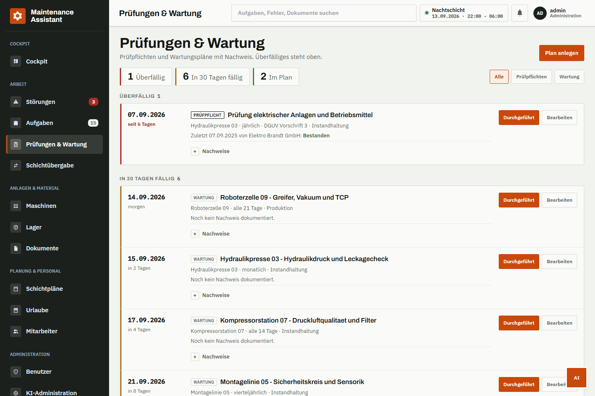
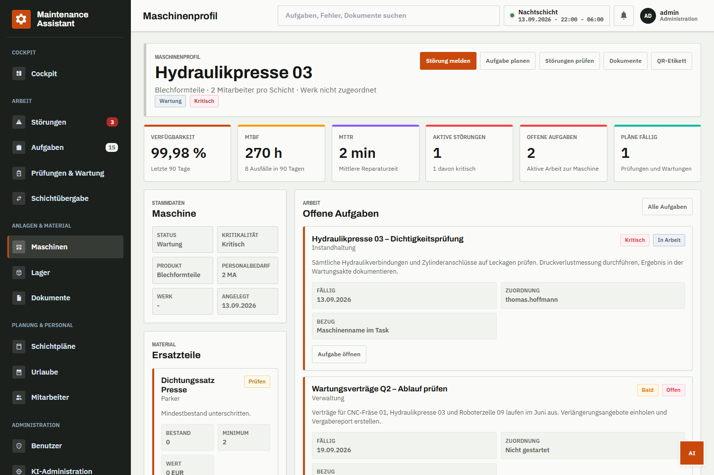
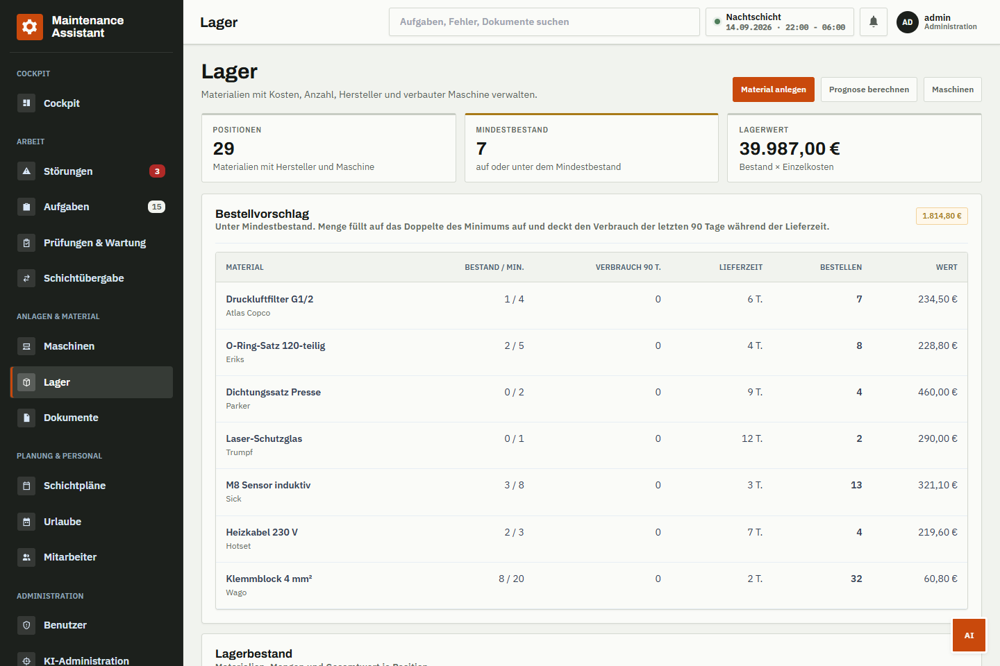
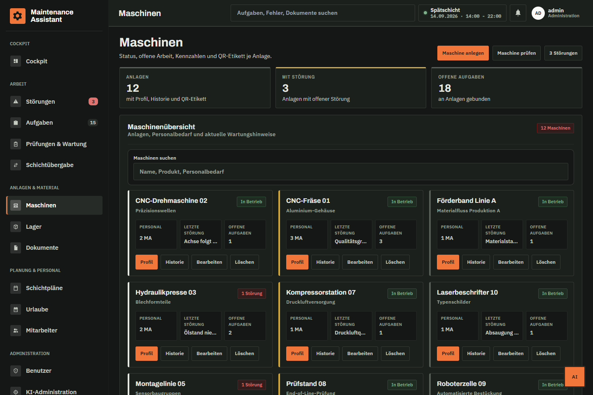
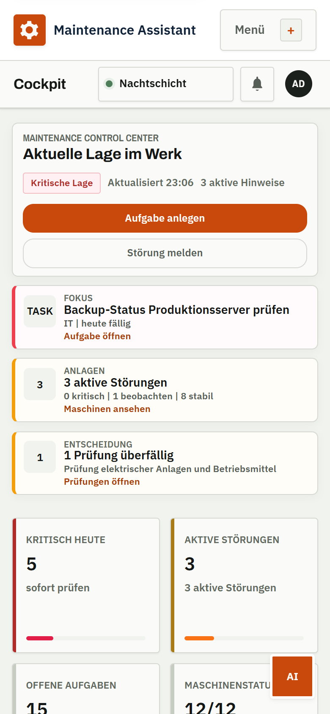
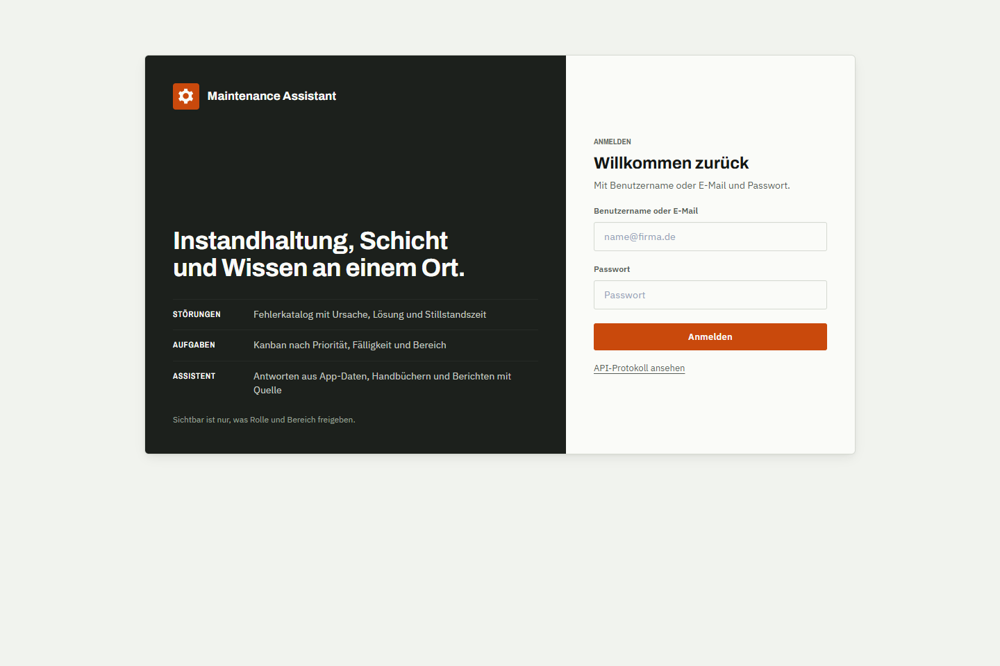
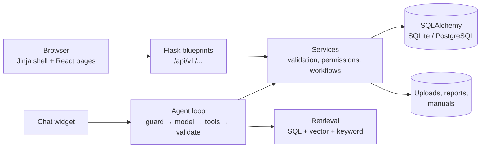

# Maintenance Assistant

[](https://github.com/siinanXD/maintenance-ai-assistant/actions/workflows/ci.yml)
[](https://www.python.org/)
[](./Dockerfile)

Software for maintenance teams in manufacturing. A technician reports a fault
with a photo at the machine, a work order is raised from it, spare parts are
booked against the order, and legally required inspections are documented with
proof. An assistant answers questions from the plant's own data and manuals and
always names its sources.

## Screenshots

Captured at 1440×960 from a fresh `python seed.py demo` database.

| Cockpit | Incidents |
| --- | --- |
|  |  |

| Inspections & maintenance | Machine profile |
| --- | --- |
|  |  |

| Stock and reorder | Assistant |
| --- | --- |
|  |  |

| Dark mode |
| --- |
|  |

<p> </p>

## What a maintenance team does with it

**Report and fix**
- Report an incident with photos straight from the phone camera; the file type is
  checked from the content, not the name.
- Match it against the fault catalog (similar errors, known cause and fix).
- Raise a work order from the incident in one click, prefilled with finding,
  cause, fix and a priority from the severity. Completing the order can close
  the incident.
- Kanban board for work orders by status, due date and department.

**Machines and parts**
- Machine profile with open work, incident history, documents, handovers and
  availability, MTBF and MTTR over the last 90 days.
- QR label per machine; scanning opens the profile, "Störung melden" opens the
  form with the machine filled in.
- Spare parts are withdrawn against a work order; stock never goes negative.
  Goods receipts, movement history and a reorder list that covers the supplier
  lead time.

**Inspections and maintenance**
- Recurring maintenance and legally required inspections (for example DGUV V3,
  BetrSichV) with interval and legal basis.
- Each execution is documented with date, inspector and result. Defects create
  a follow-up order; a failed inspection schedules a re-test after seven days.

**Shift and people**
- Shift handover log, shift planning with German working-time rules (ArbZG),
  vacation requests with approval, employee records with access levels.

**Assistant**
- Tool-using agent over the same permission-checked services: counts and lists
  from app data, answers from manuals and reports with sources, work order
  drafts that the user confirms before anything is written.
- Works without an API key (local mock provider); OpenAI or any
  OpenAI-compatible endpoint when configured.

**Access and operations**
- Roles, departments and read/write permission per area; audit log for
  security-relevant changes.
- Backups, health checks, OpenAPI docs, Docker Compose, CI with coverage gate.

## Quick start

Python 3.11 or 3.12. Node.js is only needed to rebuild CSS or React assets.

```bash
python -m venv .venv
source .venv/bin/activate        # Windows: .\.venv\Scripts\Activate.ps1
pip install -r requirements.txt
cp .env.example .env             # Windows: copy .env.example .env
python seed.py demo
python run.py --host 127.0.0.1 --port 5050
```

Open `http://127.0.0.1:5050` and sign in:

| Username | Password | Role |
| --- | --- | --- |
| `admin` | `Demo1234!` | Master Admin |
| `thomas.hoffmann` | `Demo1234!` | Maintenance |
| `dirk.hartmann` | `Demo1234!` | Production |
| `ralf.bergmann` | `Demo1234!` | IT |

`python seed.py test` creates minimal smoke-test users, `python seed.py
production` creates departments and an optional admin from environment
variables and never a demo password.

Docker (PostgreSQL + pgvector, offline embeddings):

```bash
docker compose --profile pgvector up --build
```

All settings, the MongoDB Atlas profile, scheduled jobs and the background
worker are described in [`docs/CONFIGURATION.md`](docs/CONFIGURATION.md).
Before a production release, go through
[`docs/PRODUCTION_DEPLOYMENT_CHECKLIST.md`](docs/PRODUCTION_DEPLOYMENT_CHECKLIST.md).

## Architecture



- **Routes stay thin.** They check the permission, call a service and return its
  `(result, error, status)` tuple as JSON.
- **Permissions live in the services.** Department scoping and per-area
  read/write rights apply the same way to pages, API and assistant tools.
- **The assistant has no side door.** Every tool calls the same service a page
  would; write tools return a signed pending action that the user confirms.
- **Frontend:** Jinja renders the shell, each page is a React app with its own
  Vite entry, built into `app/static/react`. Pages share one header, stat strip
  and dialog. Styles come from design tokens exported from Figma
  (`design/tokens`) and Tailwind; light and dark design follow the system
  setting or the choice in the user menu. See [`frontend/README.md`](frontend/README.md).

Deeper reading: [`docs/AI_AGENT.md`](docs/AI_AGENT.md) (agent and tools),
[`docs/AI_RAG_ARCHITECTURE.md`](docs/AI_RAG_ARCHITECTURE.md) (retrieval),
[`design/tokens/README.md`](design/tokens/README.md) (design tokens).

## Project structure

```
app/
  __init__.py        app factory and blueprint registration
  domain_models/     SQLAlchemy models by area (tasks, errors, machines, ...)
  services/          business logic, permissions, retrieval
  agent/             tool-using assistant (graph, tools, queries)
  <area>/routes.py   HTTP endpoints per area: tasks, errors, machines,
                     inventory, attachments, documents, shiftplans, ...
  templates/         Jinja shell and page mount points
  static/css/src/    CSS sources by cascade layer, built into output.css
frontend/src/        React pages (one folder per page) and shared components
design/tokens/       design tokens and generated Tailwind/CSS output
migrations/          Alembic migrations
tests/               pytest suite (in-memory SQLite, mock AI)
docs/                API reference, configuration, architecture notes
```

## API

- Swagger UI: `http://127.0.0.1:5050/swagger/` (disabled by default in production)
- Reference with examples: [`docs/API_PROTOCOL.md`](docs/API_PROTOCOL.md)

Protected endpoints expect `Authorization: Bearer <access_token>`. `/api/v1` is
stable; breaking changes get a new major prefix.

## Tests

```bash
python -m ruff check .
python -m ruff format --check .
python -m pytest --cov=app --cov-fail-under=75
npm run check:react
```

The suite needs no `.env` and no external services. CI runs the same steps and
builds the Docker image.

## Documentation

| Topic | Document |
| --- | --- |
| Configuration and operations | [`docs/CONFIGURATION.md`](docs/CONFIGURATION.md) |
| API reference | [`docs/API_PROTOCOL.md`](docs/API_PROTOCOL.md) |
| Agent and tools | [`docs/AI_AGENT.md`](docs/AI_AGENT.md) |
| Retrieval architecture | [`docs/AI_RAG_ARCHITECTURE.md`](docs/AI_RAG_ARCHITECTURE.md) |
| Production checklist | [`docs/PRODUCTION_DEPLOYMENT_CHECKLIST.md`](docs/PRODUCTION_DEPLOYMENT_CHECKLIST.md) |
| Demo questions for the assistant | [`docs/AI_DEMO_QUESTIONS.md`](docs/AI_DEMO_QUESTIONS.md) |
| Changelog | [`CHANGELOG.md`](CHANGELOG.md) |

## License

MIT
