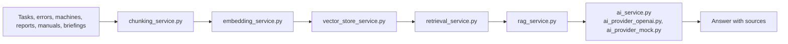

# AI And RAG Architecture

This document describes the current AI/RAG structure after cleanup. It is meant
to prevent duplicate retrieval paths from reappearing.

## Public Entry Points

- `app/ai/routes.py` owns HTTP routes and response redaction; every chat
  request runs `app/agent/service.py::run_agent`.
- The agent reaches retrieval only through tools: `search_knowledge` calls
  `build_rag_context(...)`, the `search_<scope>` tools call
  `retrieve_ai_context(...)`, and the `list_*`/`count_records` tools query
  the permission-aware SQL services directly (`app/agent/queries/`).
- `app/services/rag_service.py` is the retrieval pipeline behind
  `search_knowledge`: question -> intent classification -> retrieval ->
  context assembly. `build_rag_context(...)` returns context, sources and the
  `rag` diagnostics; `rag.pipeline_trace` lists the completed steps. Answers are
  generated only in the agent loop.

## Retrieval

- `app/services/retrieval_service.py` is the single orchestration layer for
  structured retrieval, vector retrieval, context assembly and final ranking.
- `app/services/ai_retrieval.py` remains the structured SQL retrieval component
  used by the agent's `search_<scope>` tools and the consolidated retrieval
  pipeline.
- `app/services/sql_keyword_retrieval_service.py` remains a fallback only. It is
  not a primary retrieval path.
- `app/services/vector_store_service.py` picks the vector store; the adapters
  live in `vector_store_sql.py`, `vector_store_chroma.py` and
  `vector_store_atlas.py`. Local, pgvector, Chroma and Atlas-compatible paths
  must stay available while configured deployments rely on them.
- Vector-store candidates are never authoritative by themselves. SQL remains the
  system of record for permissions, visibility, document status, quality gates
  and source-card metadata.
- Source-card route hints use `source_url(...)` from the knowledge-service
  facade so indexing, linking, network views and vector metadata share one URL
  mapping.

## Indexing And Vector Stores

- `app/services/semantic_chunking_service.py` creates semantic chunk structure
  while `app/services/chunking_service.py` stays available as the migration
  fallback.
- `app/services/knowledge_indexing_service.py` persists `KnowledgeChunk`
  records and embeddings before syncing configured external vector stores.
- `VectorRecord.embedding` carries existing chunk embeddings into external
  stores. Vector-store sync must not regenerate embeddings when chunks already
  have embeddings.
- `mongodb_atlas` is an optional external candidate store. Atlas stores synced
  chunk text, embeddings and flattened safe metadata only; business data stays
  in SQL.
- Atlas fallback diagnostics must remain visible through retrieval debug,
  vector-store diagnostics, observability metrics and governance alerts.

## Prompts

- `app/services/ai_prompting.py` owns code-level fallback prompts.
- `app/services/ai_prompt_admin_service.py` owns DB-backed prompt templates and
  resolves them over code-level fallbacks.
- Obsolete standalone prompt constants should not be added. New prompt behavior
  should go through the prompt builder functions or managed prompt templates.

## Traceability And Observability

- `app/services/ai_traceability_service.py` stores internal `AIAnswerTrace`
  records and is the system of record for answer traceability.
- `app/services/langfuse_service.py` is an optional external sink. It may receive
  sanitized correlation metadata, but not raw prompts, raw answers, chunk text,
  private paths, secrets or internal notes.
- `app/services/ai_observability_service.py` aggregates request, retrieval,
  answer-quality, vector-store and Atlas metrics without double-counting AI
  requests. Its parts live next to it: `ai_observability_chats.py` (log rows,
  answer quality, knowledge gaps), `ai_observability_sources.py` (retrieval
  hits, scores, freshness), `ai_observability_actions.py` (recommended actions
  and quality gates), `ai_observability_debug.py` (one request, prompt-safe)
  and `ai_observability_common.py` (thresholds, labels, numeric helpers).
- `app/services/vector_sync_status_service.py` owns in-process vector and Atlas
  sync diagnostics used by observability and governance.

## Governance

- `app/services/ai_governance_service.py` evaluates alert rules from existing
  observability and vector-drift snapshots.
- Atlas-specific alerts reuse the same governance framework. They must not
  duplicate generic vector-store alerts when Atlas context is present.
- Alert configuration belongs in environment-backed Flask config, not hardcoded
  route or dashboard logic.

## Cleanup Guardrails

- Do not remove fallback mechanisms used by tests, local development or
  production recovery.
- Do not move modules that are imported through `app.ai.services` without a
  migration step for existing imports.
- Do not add keyword-only retrieval as a primary path. Keep it as fallback.
- Keep SQL permission checks, visibility checks, document status and quality
  gates in the retrieval path.
- Do not make Langfuse authoritative for answer traces.
- Do not expose MongoDB URIs, OpenAI keys, raw prompts, raw answers, raw chunk
  text, private file paths or internal notes in diagnostics.
- After changing the embedding provider, embedding model or vector store,
  fully reindex knowledge documents.

## Implementation notes

The assistant is prepared as a modular Retrieval Augmented Generation pipeline,
not as a direct chatbot bolted onto CRUD screens.

Current implementation:
- `chunking_service.py` delegates the default `hybrid_semantic` mode to `semantic_chunking_service.py`, which chunks by headings, sections, tables, procedures, maintenance instructions and error catalog entries while preserving hierarchy metadata. `legacy_fixed` remains available as a temporary migration fallback.
- `embedding_service.py` abstracts embeddings. It defaults to OpenAI embeddings (`text-embedding-3-small`) for RAG, while deterministic local hashing remains available for tests and offline fallback.
- Embedding dimensions are provider-dependent: hashing uses 384 dimensions by default, while OpenAI `text-embedding-3-small` uses 1536 dimensions. The indexing path validates known provider dimensions and stores chunk metadata for the embedding model and dimension count.
- Missing OpenAI embedding credentials activate a visible hashing fallback for tests, CI and offline development; production deployments should set `OPENAI_API_KEY` and reindex knowledge.
- Nach Änderung des Embedding Providers müssen Knowledge-Dokumente neu indexiert werden.
- Nach Änderung von Chunking-Modus oder Chunking-Schema müssen Knowledge-Dokumente neu indexiert werden.
- See `docs/RAG_SEMANTIC_CHUNKING_MIGRATION.md` for the semantic chunking rollout and fallback plan.
- `vector_store_service.py` picks the vector backend: PostgreSQL pgvector when available, with local SQLAlchemy, optional Chroma and optional MongoDB Atlas Vector Search fallbacks. The backends live in `vector_store_sql.py`, `vector_store_chroma.py` and `vector_store_atlas.py` (with the Atlas circuit breaker); `vector_store_common.py` holds the result types, thresholds and the visibility filter they share.
- `RAG_VECTOR_STORE=mongodb_atlas` enables Atlas as an external candidate store. Atlas stores synchronized Knowledge chunks only: `record_id`, `document_id`, `chunk_id`, `text`, `embedding` and safe flat metadata. SQL remains the source of record for permissions, document status, visibility, quality gates and source cards.
- Atlas Vector Search requires an infrastructure-managed index: collection `knowledge_vectors`, path `embedding`, dimensions `1536`, similarity `cosine`. The app does not create this index on startup.
- Atlas retrieval uses OpenAI `text-embedding-3-small` vectors. If Atlas is unavailable, missing `pymongo`, misconfigured or timing out, retrieval falls back visibly to the local SQL vector path and exposes `fallback_active`, `fallback_reason`, `vector_store_diagnostics` and Atlas observability counters.
- Vector retrieval fetches a larger rerank candidate pool via `RAG_RERANK_CANDIDATE_LIMIT` and exposes only the final answer context via `RAG_TOP_K`.
- Nach Änderung von Embedding Provider, Embedding Modell oder Vector Store müssen Knowledge-Dokumente vollständig neu indexiert werden.
- RAG scoring weights (`RAG_SCORE_*`), recency, aging and feedback windows are configuration-only tuning knobs; keep `RAG_SCORE_DEBUG=false` outside diagnostics because score details are admin-facing explainability, not user answer text.
- `retrieval_service.py` combines permission-aware structured retrieval with RAG knowledge chunks.
- `rag_service.py` is the retrieval pipeline behind the agent's `search_knowledge` tool (`build_rag_context`); the answer itself is generated in the agent loop.
- Empty retrieval never turns into an unsourced prompt: `search_knowledge` returns a grounded local no-answer (`## Keine belastbare Quelle gefunden`) and the response carries `diagnostics.empty_retrieval=true`.
- AI chat and the error assistant are rate limited per user via `AI_CHAT_RATE_LIMIT_PER_MINUTE` and answer `429` with `Retry-After` when exceeded.
- `retrieval_service.py` remains the single retrieval orchestration layer. Structured SQL retrieval, vector retrieval and keyword fallback stay separated as components; see `docs/AI_RAG_ARCHITECTURE.md`.
- See `docs/MONGODB_ATLAS_VECTOR_SEARCH.md` for Atlas Vector Search setup, index configuration and fallback behavior.
- `ai_traceability_service.py` stores metadata-only answer traces connected to chat messages and AI audit events. See `docs/AI_ANSWER_TRACEABILITY.md`.
- `ai_observability_service.py` and its `ai_observability_*` companions aggregate existing audit, chat and retrieval telemetry for the AI Admin dashboard. See `docs/AI_OBSERVABILITY.md`.
- `knowledge_gap_service.py` records open `KnowledgeGap` entries when AI chat cannot find reliable RAG/source context; recent duplicate questions are folded into one gap.
- `maintenance_tag_service.py` provides the seeded maintenance taxonomy for Fehlerarten, Ursachen, Loesungen, Maschinenbereiche and Risiko/Prioritaet, and returns local keyword-based tag suggestions without requiring an AI key.
- Generated maintenance reports and uploaded machine manuals are processed automatically into `KnowledgeDocument` rows, summaries, metadata hints and searchable `KnowledgeChunk` records.
- `POST /api/v1/admin/ai/knowledge/reindex` runs the current ingestion workflow and registers generated reports, error catalog entries, tasks, maintenance plans, machine manuals, and shift handovers as RAG sources.
- `POST /api/v1/admin/ai/knowledge/reindex?mode=stale` reindexes only pending or stale RAG documents.
- `POST /api/v1/admin/ai/knowledge/{id}/reindex` reindexes one document for granular admin recovery.
- `GET/POST/PUT/DELETE /api/v1/admin/ai/training` lets master admins maintain manual Q&A training entries that are indexed as `manual_training` knowledge and marked stale on changes.
- `POST /api/v1/machines/{machine_id}/assistant` enriches the machine-specific history with matching RAG sources and returns source metadata alongside the answer.
- `POST /api/v1/ai/error-assistant` returns catalog matches, RAG sources, a read-only task draft and evidence-based root-cause analysis.
- `GET /api/v1/handover/{id}/summary` returns a read-only shift-handover summary from the handover, visible open tasks and visible disruptions.
- `POST /api/v1/tasks/suggest` can attach RAG source metadata to AI task drafts without persisting anything.
- `POST /api/v1/tasks/prioritize` can use visible task history, maintenance reports and related fault signals for read-only priority recommendations.
- `GET /api/v1/admin/ai/knowledge-gaps` lists unanswered or low-confidence AI questions and includes read-only gap detection for machines, departments, search terms and missing documentation actions.
- `GET /api/v1/admin/ai/observability` exposes AI Admin metrics for frequent questions and search terms, tokens, cost windows, latency, failed requests, retrieval hit rate, no-answer rate, feedback, most-used documents and knowledge gaps.
- AI observability includes answer-quality distributions, primary warning types, uncertainty rates and per-request confidence uncertainty so admins can distinguish grounded answers from no-answer, conflict and high-uncertainty cases.
- AI governance alerts are integrated into observability and the Admin AI technical dashboard. They flag high no-source rates, retrieval degradation, cost spikes, excessive token usage, hallucination risk, sync failures and vector-store failures; see `docs/AI_GOVERNANCE_ALERTING.md`.
- Retrieval evaluation history includes a prompt-safe quality gate. Permission leaks fail the gate; weak Recall@K, MRR, keyword coverage, no-result handling, query-type accuracy or source metadata coverage create warnings.
- AI observability also returns prioritized recommended actions. Root-level `next_best_action`, `recommended_actions` and `recommended_action_summary` combine evaluation failures, weak retrieval hits, stale or undated source metadata, and knowledge-gap remediation into one admin-ready action queue with priority, rank and source distribution.
- High-uncertainty answer clusters are surfaced as potential knowledge gaps with `review_uncertain_answer_gap` actions, next steps and success criteria.
- `GET /api/v1/ai/daily-briefing` can include an `AI-Wissenskontext` section from visible RAG sources.
- `GET /api/v1/machines/maintenance-recommendations` returns read-only Maintenance Recommendation Light results from visible task, error, maintenance-plan, report and RAG history. It is heuristic and explicitly not a predictive-maintenance forecast.

Provider behavior:
- `AI_PROVIDER=openai` uses the official OpenAI-compatible client with `OPENAI_API_KEY`.
- `AI_PROVIDER=openai_compatible` uses the same client with `AI_BASE_URL` for local OpenAI-compatible endpoints.
- `EMBEDDING_PROVIDER=openai_compatible` also uses `AI_BASE_URL` for local OpenAI-compatible embedding APIs and falls back to hashing when required config is missing.
- `EMBEDDING_PROVIDER=hashing` is retained for tests/offline fallback, not as the primary development or production default.
- See `docs/EMBEDDING_PROVIDER_CONFIGURATION.md` for provider selection, dimensions, fallback and reindex rules.
- `AI_PROVIDER=mock` keeps all standard tests and local fallback workflows offline.
- Unsupported providers such as `gemini` currently fall back visibly to `mock` until a dedicated adapter is implemented.

### Maintenance Agent

The chat (`POST /api/v1/ai/chat`) is a
tool-using agent on top of the same services: a LangGraph loop with a
deterministic safety guard, provider tool selection (OpenAI function calling
or the offline mock policy), permission-gated tool execution and validation.
Structured questions (counts, filtered lists, status, availability) are
answered by parameterized tools (`list_tasks`, `list_incidents`,
`count_records`, `list_employees`, `list_employee_documents`,
`list_vacations`, `list_documents`, `list_shift_entries`, `list_inventory`,
`machine_incident_report`); free-text and how-to questions use the `search_*`
tools and the hybrid `search_knowledge` RAG tool; machine profiles, the error
assistant, task drafts, prioritization, order planning and the daily briefing
are tools as well. Write tools (`create_task`, `request_knowledge_reindex`)
only return a signed `pending_action` that the user confirms through
`POST /api/v1/ai/agent/confirm`. Responses carry `answer_category`
(`structured_data`, `rag`, `general_ai_knowledge`, `agent`) and
`structured_context`, which the next turn of the same session reuses for
follow-ups ("welche davon in der Produktion?"). Session memory is persisted
by a LangGraph checkpointer (PostgreSQL, SQLite or in-process). See
[`docs/AI_AGENT.md`](docs/AI_AGENT.md) and `flask --app run:app agent eval-tools`.

### Automated Knowledge Lifecycle

The knowledge lifecycle is consolidated around existing services instead of a
separate monolith:

1. Sources are created in tasks, errors, documents, manuals, handovers or
   manual AI training.
2. `knowledge_service.py` and `document_knowledge_processing_service.py`
   register them as `KnowledgeDocument` rows with `draft` or `ai_suggested`
   quality status.
3. Existing similarity and retrieval services find related error entries or RAG
   chunks; missing-information prompts come from `missing_information_service.py`.
4. Technicians and master admins move entries through `technician_confirmed`,
   `admin_approved`, `outdated` or `rejected` via
   `knowledge_quality_service.py`.
5. Indexed and visible knowledge chunks are used by RAG. The admin status API
   exposes a `lifecycle` section with review queues, open feedback, open
   knowledge gaps and the current RAG quality-gate state.
6. `ai_feedback_service.py` stores answer feedback for review, and
   `knowledge_gap_service.py` deduplicates unanswered or low-confidence AI
   questions into open knowledge gaps.

RAG retrieval applies per-document quality gates via
`retrieval_quality_gate_for_document()` in `knowledge_quality_service.py`.
Draft, outdated, rejected, and unknown statuses are blocked by default. Set
`RAG_STRICT_QUALITY_GATE=true` (see `.env.example`) to allow only
`admin_approved` and `technician_confirmed` chunks during vector/SQL retrieval.
The admin status API still exposes lifecycle queues and gate diagnostics for
review workflows.

Employee master data and confidential `EmployeeDocument` files are structured
chat sources only; they are not embedded into `KnowledgeDocument` unless an
explicit indexing policy is added later.

Initial RAG-ready data sources:
- `ErrorEntry`: error code, machine, title, description, possible causes, solution, department, `machine_id`.
- `GeneratedDocument` and `MachineManual`: reports/manual metadata plus extracted or stored text.
- `KnowledgeDocument` and `KnowledgeChunk`: already indexed local knowledge base for uploaded TXT/HTML/PDF and generated reports.
- `Task`, `MaintenancePlan`, and `ShiftHandover`: indexed as structured operational context by the reindex workflow.
- `AssistantTrainingEntry`: manually curated question, answer, keywords, category, department, active state and priority.
- `Machine`, `ChatMessage`, and AI briefings are suitable next candidates once metadata fields and retention rules are normalized.

Metadata to preserve for future vector stores: `machine_id`, `task_id`,
`error_id`, `document_type`, `department`, `source_type`, `source_id`, and
timestamp fields. Sensitive employee fields must stay behind the existing
permission model and should not be embedded without an explicit data policy.
